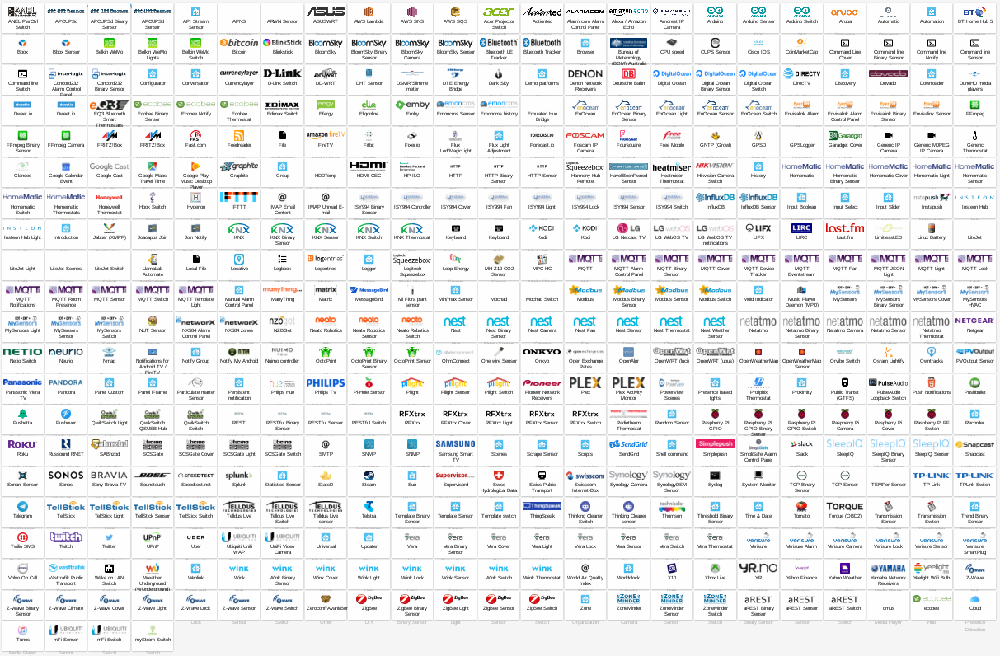
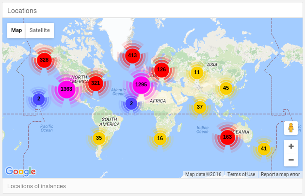

# Einführung

## Internet of things

- Lampen
- Schalter
- Thermostat
- Wasserkocher
- Zahnbürste
- Kameras
- Staubsauger
- Waschmaschine
- Bewässerung
- Schlösser
- Temperatur
- Türen
- Tierfütterung

## Protokolle & Busse

- SOHO-Einsatz
  - Bluetooth, Bluetooth LE, IEEE 802.x, Z-Wave, X10, KNX, ZigBee, IR, LoRA, SCS, Universal Powerline Bus, Insteon, EnOcean, C-BUS, etc.
- Industrieller Einsatz
  - CAN, Profibus, Modbus, Interbus, EtherCAT, ControlNet, SafetyBUS, BitBus, etc.

## Home Assistant

- Python 3
- MIT
- etwas mehr als 3 Jahre alt (Erster Commit: 17. September 2013)
- Validierung mit PEP8, PyFlakes und PyLint
- 94 % Test coverage (ohne Integrationen)
- Automatische Abhängigkeitsverwaltung

Demo: [https://home-assistant.io/demo/](https://home-assistant.io/demo/)

## Verfügbare Implementierungen

- MQTT, EnOcean, Insteon, Modbus, RFXtrx, Z-Wave, ZigBee, SCSGate, KNX
- Arduino, Raspberry PI GPIO, Particulate Matter, Mi Flora
- Webservices



Übersicht: [https://home-assistant.io/components/#all](https://home-assistant.io/components/#all)


## Wo?



## Installation

```bash
$ pip3 install homeassistant
$ hass --open-ui
```

### Alternativen

- [HASSbian](https://home-assistant.io/getting-started/installation-raspberry-pi-image/) (Image)
- [Raspberry Pi All-In-One Installer](https://home-assistant.io/getting-started/installation-raspberry-pi-all-in-one/)
- [Docker](https://home-assistant.io/getting-started/installation-docker/)
- [Vagrant](https://home-assistant.io/getting-started/installation-vagrant/)
- [Synology NAS](https://home-assistant.io/getting-started/installation-synology/)


### Unterstützung (Zukunft)

- C.H.I.P (Image)
- Ansible
- Pakete in Fedora und Alpine Linux
- Kompletter Wechsel zu [asyncio](https://docs.python.org/3/library/asyncio.html)

## Setup und Konfiguration

```bash
homeassistant:
  latitude: 46.94
  longitude: 7.45
  elevation: 558.4
  unit_system: metric
  time_zone: Europe/Zurich
  name: Wohnung
sun:
sensor:
  - platform: cpuspeed
    name: CPU
  - platform: waqi
    locations:
      - bern bollwerk
switch:
  - platform: mystrom
    host: 10.100.0.104
    name: MyStrom Switch
```

## Start

```bash
$ hass
```


### Demo mode

```bash
$ hass --demo-mode
```

### Frontend öffnen

```bash
$ hass --open-ui
```

### Autostart

- [systemd](https://home-assistant.io/getting-started/autostart-systemd/)
- [upstart](https://home-assistant.io/getting-started/autostart-upstart/)
- [macOS](https://home-assistant.io/getting-started/autostart-macos/)

# Resourcen


- **Dokumentation**: [https://home-assistant.io/](https://home-assistant.io/)
- **Community**: [https://community.home-assistant.io/](https://community.home-assistant.io/)
- **Chat**: [https://gitter.im/home-assistant/home-assistant](https://gitter.im/home-assistant/home-assistant)


