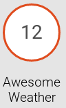
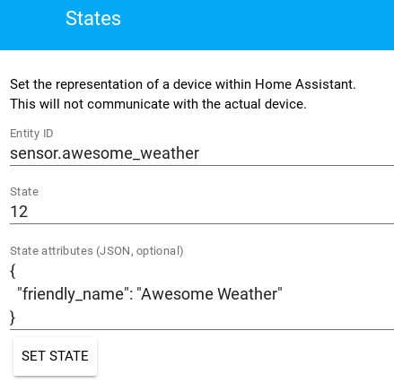
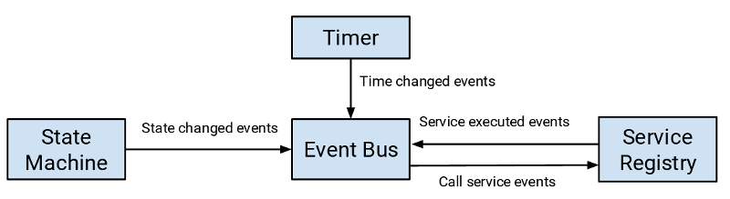

# Platform

## Unterstützung für "Dinge"

- Eine `entity`-Komponente für einen Typen von "Ding"
- Implementation als Platform
- Abstrakte Basis-Klasse (ABC), die mit Home Assistant Core kommuniziert
  - Verfügbare Information (`is_on`, `rgb_color`, `brightness`)
  - Methoden, die aufgerufen werden können (`turn_on`, `turn_off`)

## AwesomeWeather-Station

- bester Wetter-Station
- Smartphone App
- keine Dokumentation


### Awesome Weather Station API

Abfragen mit `curl`.

```bash
$ curl http://192.168.0.209:5000/weather
{
    "details": {
        "lat": 7.431203,
        "long": 46.941257
    },
    "hum": 78,
    "led": null,
    "name": "AwesomeWeather",
    "sun": "0",
    "temp": 4,
}
```
Alternativen

```bash
$ http --json http://192.168.0.209:5000/weather
$ wget -qO- http://192.168.0.209:5000/weather
```

### Integration mit `command_line`-Sensor

```bash
sensor:
  - platform: command_line
    command: curl http://192.168.0.209:5000/weather
    value_template: {{ value_json.temp }}
```

Details: [command_line-Sensor](https://home-assistant.io/components/sensor.command_line/)

### Integration mit `rest`-Sensor

```bash
sensor:
  - platform: rest
    resource: http://192.168.0.209:5000/weather
    value_template: {{ value_json.temp }}
```

Details: [rest-Sensor](https://home-assistant.io/components/sensor.rest/)

## Was ist verfügbar?

- Alarm Control Panel
- Binary Sensor
- Calendar
- Camera
- Climate
- Cover
- Device Tracker
- Fan
- Light
- Lock
- Media Player
- Sensor
- Switch
- Weather


## awesome_weather-Sensor

- zeigt Temperatur an
- wird eine Platform und gehört zur Entität `sensor`
- keine Abhängigkeiten

 


### `awesome_weather`-Platform

```python
from homeassistant.helpers.entity import Entity

def setup_platform(hass, config, add_devices, discovery_info=None):
    """Set up the Awesome Weather sensor platform."""
    add_devices([AwesomeWeatherSensor()])


class AwesomeWeatherSensor(Entity):
    """Representation of an Awesome Weather sensor."""

    @property
    def name(self):
        """Return the name of the sensor."""
        return 'Awesome Weather'

    @property
    def state(self):
        """Return the state of the sensor."""
        return 12
```

### Installation

Verschieben nach `<config_dir>/custom_components/sensor/awesome_weather.py`

Konfigurationseintrag in `configuration.yaml`:

```bash
sensor:
  - platform: awesome_weather
```

#### Speicherort für die Konfiguration

| Betriebssystem | Pfad |
|:-------------- | ----:|
| macOS | `~/.homeassistant` |
| Linux | `~/.homeassistant` |
| Windows | `%APPDATA%/.homeassistant` |


### Resultat



## Typen der Integration

- Abhängigkeit
  - Standard-Module
  - Dritt-Module (PyPI, Github, etc.)
- Kommunikation
  - USB, seriell
  - TCP/IP
  - Funk (Z-Wave, ZigBee, etc.)

## Umformung

```bash
$ curl http://192.168.0.209:5000/weather
```

```python
import requests

result = requests.get('http://192.168.0.209:5000/weather')
print(result.text)
```

## Anforderungen

```python
REQUIREMENTS = ['requests==2.0.0']
```

Aktualisieren von `requirements_all.txt`

```bash
$ script/gen_requirements_all.py
```

Hier nicht nötig, da `requests` bereits vorhanden ist.

## Daten beziehen

```python
from homeassistant.helpers.entity import Entity

def setup_platform(hass, config, add_devices, discovery_info=None):
    """Set up the Awesome Weather sensor platform."""
    add_devices([IpAddressSensor()])

class IpAddressSensor(Entity):
    """Representation of an Awesome Weather sensor."""

    def __init__(self):
        """Initialize the sensor."""
        self._state = False
        self.update()

    @property
    def name(self):
        """Return the name of the sensor."""
        return 'Awesome Weather'

    @property
    def state(self):
        """Return the state of the sensor."""
        return self._state

    def update(self):
        """Get the latest data from station and updates the state."""
        import requests
        self._state = requests.get('http://192.168.0.209:5000/weather').json()['temp']
        print("Update the sensor's state: %s", self._state)
```

## Logging

Ausgeben von Details in der Konsole oder im Log-File.

```python
import logging

_LOGGER = logging.getLogger(__name__)

_LOGGER.info("Update the sensor's state: ", self._state)
```

- `_LOGGER.info(msg)`
- `_LOGGER.warning(msg)`
- `_LOGGER.error(msg)`
- `_LOGGER.critical(msg)`
- `_LOGGER.exception(msg)`

## Konfiguration

```python
def setup_platform(hass, config, add_devices, discovery_info=None):
```

### `config`

- Dictionary
- Informationen aus `configuration.yaml`

Inhalt `config`:

```python
{'platform': 'awesome_weather'}
```

## Optionen

```bash
sensor:
  - platform: awesome_weather
    host: 192.168.0.209
    port: 5000
```

Inhalt `config`:

```python
{'port': 5000, 'host': '192.168.0.209', 'platform': 'awesome_weather'}
```

## Validierung der Konfiguration

- Keine Test nötig während Platform-Setup
- Erweiterbarkeit
- Reduktion des Aufwand für neue Platformen


```python
import voluptuous as vol

import homeassistant.helpers.config_validation as cv
from homeassistant.const import CONF_HOST, CONF_PORT
from homeassistant.components.sensor import PLATFORM_SCHEMA

PLATFORM_SCHEMA = PLATFORM_SCHEMA.extend({
    vol.Required(CONF_HOST): cv.string,
    vol.Optional(CONF_PORT, default=5000): cv.port,
})
```

### Schema-Beispiele

```python
vol.All(vol.Coerce(int), vol.Range(min=1, max=65535))
```

```python
vol.Optional(CONF_METHOD, default='GET'): vol.In(['POST', 'GET'])
```

```python
vol.Optional(CONF_VARIABLES, default=[]):
        vol.All(cv.ensure_list, [vol.In(['POST', 'GET'])]),
```

### Prüfung der Konfiguration

```bash
$ hass --script check_config
```

```bash
Testing configuration at /home/fab/.homeassistant
02-11-01 16:29:06 ERROR (MainThread) [homeassistant.bootstrap] Invalid config
for [sensor.awesome_weather]: expected int for dictionary value @ data['port'].
Got 'abc'. (See ?:?).
Please check the docs at https://home-assistant.io/components/sensor.awesome_weather/
Failed config
  sensor.awesome_weather: 
    platform: awesome_weather
    host: 192.168.0.209
    port: abc

Successful config (partial)
  sensor.awesome_weather:
```

### Gegebene Konfiguration

```python
import logging

import voluptuous as vol

import homeassistant.helpers.config_validation as cv
from homeassistant.components.sensor import PLATFORM_SCHEMA
from homeassistant.const import CONF_HOST, CONF_PORT
from homeassistant.helpers.entity import Entity

_LOGGER = logging.getLogger(__name__)

PLATFORM_SCHEMA = PLATFORM_SCHEMA.extend({
    vol.Required(CONF_HOST): cv.string,
    vol.Optional(CONF_PORT, default=5000): cv.port,
})

def setup_platform(hass, config, add_devices, discovery_info=None):
    """Set up the Awesome Weather sensor platform."""
    host = config.get(CONF_HOST)
    port = config.get(CONF_PORT)
    add_devices([AwesomeWeatherSensor(host, port)])

class AwesomeWeatherSensor(Entity):
    """Representation of an Awesome Weather sensor."""

    def __init__(self, host, port):
        """Initialize the sensor."""
        self.host = host
        self.port = port
        self._state = False
        self.update()

    @property
    def name(self):
        """Return the name of the sensor."""
        return 'Awesome Weather'

    @property
    def state(self):
        """Return the state of the sensor."""
        return self._state

    def update(self):
        """Get the latest data and updates the state."""
        import requests
        url = '{}{}:{}/{}'.format('http://', self.host, self.port, 'weather')
        self._state = requests.get(url).json()['temp']
        _LOGGER.info("Update the sensor's state: %s", self._state)
```

## Throttle

- Drosselung der Anfragen
- gibt `None` zurück, wenn Wert nicht geändert hat
- einstellbares Interval

```python
import logging
from datetime import timedelta

import voluptuous as vol

import homeassistant.helpers.config_validation as cv
from homeassistant.components.sensor import PLATFORM_SCHEMA
from homeassistant.const import CONF_HOST, CONF_PORT, ATTR_LONGITUDE, ATTR_LATITUDE, TEMP_CELSIUS
from homeassistant.helpers.entity import Entity
from homeassistant.util import Throttle

_LOGGER = logging.getLogger(__name__)

MIN_TIME_BETWEEN_UPDATES = timedelta(seconds=10)

PLATFORM_SCHEMA = PLATFORM_SCHEMA.extend({
    vol.Required(CONF_HOST): cv.string,
    vol.Optional(CONF_PORT, default=5000): cv.port,
})

def setup_platform(hass, config, add_devices, discovery_info=None):
    """Set up the Awesome Weather sensor platform."""
    host = config.get(CONF_HOST)
    port = config.get(CONF_PORT)

    data = AwesomeWeatherData(host, port)
    add_devices([AwesomeWeatherSensor(data)])

class AwesomeWeatherSensor(Entity):
    """Representation of an Awesome Weather sensor."""

    def __init__(self, data):
        """Initialize the sensor."""
        self.data = data
        self._data = False
        self.update()

    @property
    def name(self):
        """Return the name of the sensor."""
        return 'Awesome Weather'

    @property
    def state(self):
        """Return the state of the sensor."""
        return self._data['temp']

    @property
    def unit_of_measurement(self):
        """Return the unit of measurement."""
        return TEMP_CELSIUS

    @property
    def device_state_attributes(self):
        """Return the state attributes."""
        if self._data is not None:
            return {
                'led': self._data['led'],
                'humitidy': self._data['hum'],
                'sun': self._data['sun'],
                ATTR_LONGITUDE: self._data['details']['long'],
                ATTR_LATITUDE: self._data['details']['lat'],
            }

    def update(self):
        """Get the latest data and updates the state."""
        self.data.update()
        self._data = self.data.data

class AwesomeWeatherData(object):
    """Get the latest data and update the states."""

    def __init__(self, host, port):
        """Initialize the data object."""
        self.host = host
        self.port = port

    @Throttle(MIN_TIME_BETWEEN_UPDATES)
    def update(self):
        """Get the latest data from the Awesome Weather station."""
        import requests
        url = '{}{}:{}/{}'.format('http://', self.host, self.port, 'weather')
        self.data = requests.get(url).json()
        _LOGGER.error("Update the sensor's state: \n%s", self.data)
```


## Attribute

```python
    @property
    def unit_of_measurement(self):
        """Return the unit of measurement."""
        return TEMP_CELSIUS
```

```python
    @property
    def device_state_attributes(self):
        """Return the state attributes."""
        if self._data is not None:
            return {
                'led': self._data['led'],
                'humitidy': self._data['hum'],
                'sun': self._data['sun'],
                ATTR_LONGITUDE: self._data['details']['long'],
                ATTR_LATITUDE: self._data['details']['lat'],
            }
```

## Resultat

![][images/aw-sensor-details.png] ![][images/aw-sensor-map-be.png]

## Was noch fehlt...

- `icon()`
- `should_poll()`
- `available()`
- `hidden()`
- `assumed_state()`

## Binärer Sensor

- nur zwei Zustände
- Zuordnung von Typen möglich
- wie ein Schalten, aber als Sensor


```python
import logging

import voluptuous as vol
import requests

import homeassistant.components.awesome_weather as awesome
import homeassistant.helpers.config_validation as cv
from homeassistant.components.binary_sensor import (BinarySensorDevice, PLATFORM_SCHEMA)
from homeassistant.const import CONF_HOST, CONF_PORT

_LOGGER = logging.getLogger(__name__)

PLATFORM_SCHEMA = PLATFORM_SCHEMA.extend({
    vol.Required(CONF_HOST): cv.string,
    vol.Optional(CONF_PORT, default=5000): cv.port,
})

def setup_platform(hass, config, add_devices, discovery_info=None):
    """Set up the Awesome Weather binary sensor platform."""
    host = config.get(CONF_HOST)
    port = config.get(CONF_PORT)
    add_devices([AwesomeWeatherBinarySensor(host, port)])

class AwesomeWeatherBinarySensor(BinarySensorDevice):
    """Representation of an Awesome Weather binary sensor."""

    def __init__(self, host, port):
        """Initialize the sensor."""
        self.host = host
        self.port = port
        self.url = '{}{}:{}/{}'.format(
                        'http://', self.host, self.port, 'weather')
        self._data = False
        self.update()

    @property
    def name(self):
        """Return the name of the sensor."""
        return 'Awesome Weather'

    @property
    def is_on(self):
        """Return the state of the sensor."""
        return bool(int(self._data))

    @property
    def sensor_class(self):
        """Return the class of this sensor."""
        return 'light'

    def update(self):
        """Get the latest data and updates the state."""
        self._data = requests.get(self.url).json()['sun']
```

### Einrichtung `binary_sensor`

Verschieben nach `<config_dir>/custom_components/binary_sensor/awesome_service.py`

Konfigurationseintrag in `configuration.yaml`:

```bash
binary_sensor:
  - platform: awesome_weather
```

### Resultat


## LED einschalten

```bash
$ curl -X POST -d 'value=1' http://192.168.0.209:5000/weather
{
    "led": 1,
[...]
}

```

```python
import requests

result = requests.post(
        'http://192.168.0.209:5000/weather', data = {'state': 1})
print(result.text)
```

## Service

- keine Visualisierung
- kann durch Automatisierungen genutzt werden
- Beispiel: `notify`
- Testen mit Developer Tools oder REST API

### Architektur (vereinfacht)



### `awesome_service`

```python
import requests

DOMAIN = 'awesome_service'

ATTR_STATE = 'state'

def setup(hass, config):
    """Set up the Awesome LED service."""

    def handle_awesome(call):
        """Handler for the Awesome LED service."""
        data = {'value': call.data.get(ATTR_STATE, 1)}
        requests.post('http://192.168.0.209:5000/weather', data=data)

    hass.services.register(DOMAIN, 'awesome', handle_awesome)

    return True
```

### Einrichtung `service`

Verschieben nach `<config_dir>/custom_components/awesome_service.py`

Konfigurationseintrag in `configuration.yaml`:

```bash
awesome_service:
```

### Verwendung eines Services


```bash
$ curl -X POST -H "x-ha-access: YOUR_PASSWORD" \
  -H "Content-Type: application/json" -d '{"value": "1"}' \
  http://localhost:8123/api/services/awesome_service/
```

## Schalter `switch`

- erbt von `SwitchDevice`
- Aktionen: `turn_on` und `turn_off`
- `is_on` gibt Zustand zurück

### Implementierung


```python
import logging

import voluptuous as vol
import requests

import homeassistant.helpers.config_validation as cv
from homeassistant.components.switch import (SwitchDevice, PLATFORM_SCHEMA)
from homeassistant.const import CONF_HOST, CONF_PORT

_LOGGER = logging.getLogger(__name__)

PLATFORM_SCHEMA = PLATFORM_SCHEMA.extend({
    vol.Required(CONF_HOST): cv.string,
    vol.Optional(CONF_PORT, default=5000): cv.port,
})

def setup_platform(hass, config, add_devices, discovery_info=None):
    """Set up the Awesome Weather switch platform."""
    host = config.get(CONF_HOST)
    port = config.get(CONF_PORT)
    add_devices([AwesomeWeatherSwitch(host, port)])

class AwesomeWeatherSwitch(SwitchDevice):
    """Representation of an Awesome Weather switch."""

    def __init__(self, host, port):
        """Initialize the sensor."""
        self.host = host
        self.port = port
        self.url = '{}{}:{}/{}'.format(
                            'http://', self.host, self.port, 'weather')
        self._data = False
        self.update()

    @property
    def name(self):
        """Return the name of the switch."""
        return 'Awesome Weather'

    @property
    def is_on(self):
        """Return the state of the switch."""
        try:
            return bool(int(self._data))
        except TypeError:
            return False

    def turn_on(self, **kwargs):
        """Turn the LED on."""
        req = requests.post(self.url, data={'value': 1})

    def turn_off(self, **kwargs):
        """Turn the LED off."""
        req = requests.post(self.url, data={'value': 0})

    def update(self):
        """Get the latest data and updates the state."""
        self._data = requests.get(self.url).json()['led']
```

### Exception

- Oftmal muss in der Platform mit Fehlern umgegangen werden
- Bei der Initialisierung ist das LED: `"led": null,`

```python
    @property
    def is_on(self):
        """Return the state of the switch."""
        try:
            return bool(int(self._data))
        except TypeError:
            return False
```

### Installation `switch`

Verschieben nach `<config_dir>/custom_components/switch/awesome_weather.py`

Konfigurationseintrag in `configuration.yaml`:

```bash
switch:
  - platform: awesome_weather
    host: 192.168.0.209
```

